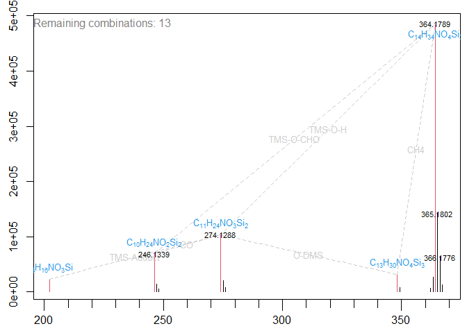
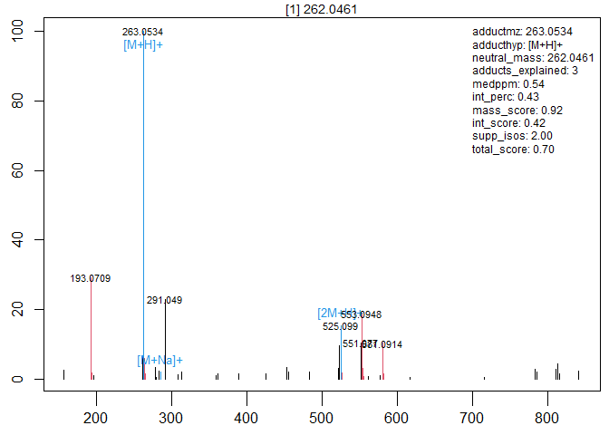

<!-- README.md is generated from README.Rmd. Please edit that file -->

# InterpretMSSpectrum

<!-- badges: start -->

[](https://CRAN.R-project.org/package=InterpretMSSpectrum)
[](https://github.com/janlisec/InterpretMSSpectrum/actions/workflows/R-CMD-check.yaml)
[](https://codecov.io/gh/janlisec/InterpretMSSpectrum)
<!-- badges: end -->

The goal of **InterpretMSSpectrum** is to provides a set of R functions
to annotate mass spectra from Electrospray-Ionization and
Atmospheric-Pressure-Chemical-Ionization derived data in positive and
negative ionization mode.

## Installation

You can install the
[CRAN](https://cran.r-project.org/package=InterpretMSSpectrum) version
of **InterpretMSSpectrum** using:

    install.packages("InterpretMSSpectrum")

or the development version from [GitHub](https://github.com/) using:

    # devtools is required to install from GitHub
    # install.packages("devtools")
    devtools::install_github("janlisec/InterpretMSSpectrum")

## Example

In the simplest case **InterpretMSSpectrum** will provide an informed
guess for the potential sum formula of an arbitrary mass spectrum.

``` r
# load APCI test data
apci_spectrum <- InterpretMSSpectrum::apci_spectrum

# find the most probable sum formula for the spectrum
# (will print to the console and open a new plot)
InterpretMSSpectrum::InterpretMSSpectrum(spec=apci_spectrum)
#> 
#> 
#> Top 8 of 13 remaining Formula combinations (ordered after mean score of combination)...
#>          73.75           56.52             26.27           21.26          
#> 202.0893 "C8H16N1O3Si1"  "C8H16N1O3Si1"    "C8H16N1O3Si1"  "C8H16N1O3Si1" 
#> 246.1339 "C10H24N1O2Si2" "C11H24N1O1S1Si1" "C8H22N4O1Si2"  NA             
#> 274.1288 "C11H24N1O3Si2" "C12H24N1O2S1Si1" "C9H22N4O2Si2"  NA             
#> 348.1477 "C13H30N1O4Si3" "C14H30N1O3S1Si2" NA              "C14H26N1O7Si1"
#> 364.1789 "C14H34N1O4Si3" "C15H34N1O3S1Si2" "C12H32N4O3Si3" "C15H30N1O7Si1"
#>          18.77             17.12             13.94           12.45          
#> 202.0893 "C8H16N1O3Si1"    "C6H14N4O2Si1"    "C6H14N4O2Si1"  NA             
#> 246.1339 NA                NA                "C10H24N1O2Si2" NA             
#> 274.1288 NA                "C10H22N4O1S1Si1" "C9H22N4O2Si2"  NA             
#> 348.1477 "C9H33N2O4P1Si3"  "C12H28N4O2S1Si2" NA              "C13H34N1S1Si4"
#> 364.1789 "C10H37N2O4P1Si3" "C13H32N4O2S1Si2" "C10H30N7O2Si3" "C14H38N1S1Si4"
#> 
#> 
#> Total number of formulas per fragment before and after filtering...
#>         mz initial score_cutoff PlausibleFormula TypicalLosses
#> 1 202.0893      30            4                2             2
#> 2 246.1339      69           28                4             4
#> 3 274.1288     114           43                4             4
#> 4 348.1477     339          118               10            10
#> 5 364.1789     402          166               13            13
#> 
#> 
#> Details of best candidate...
#>         Formula Score Valid        Mass
#> 1  C8H16N1O3Si1    75 Valid 202.0899456
#> 2 C10H24N1O2Si2    71 Valid 246.1345583
#> 3 C11H24N1O3Si2    44 Valid 274.1294729
#> 4 C13H30N1O4Si3    84 Valid 348.1482649
#> 5 C14H34N1O4Si3    79 Valid 364.1795650
```



    #> 
    #> 
    #> Time elapsed during individual processing steps...
    #> Time differences in secs
    #>  FormulaGen   ScoreFilt   Plausible NeutralLoss    PathEval        Plot 
    #>     23.8203      0.0005      0.0950      0.1035      0.2840      0.0632

The function can be tweaked with numerous parameters to limit the
results, speed up calculations and more.

The other high level function of the package allows to predict the
precursor of ESI spectra.

``` r
# load ESI test data
esi_spectrum <- InterpretMSSpectrum::esi_spectrum

# find the most likely precursor for the spectrum
(fmr <- InterpretMSSpectrum::findMAIN(spec=esi_spectrum))
#> Analyzed 102 neutral mass hypotheses (34 peaks * 3 adducts), kept 96
#> Selected m/z=263.0534 as [M+H]+ adduct of neutral mass 262.0461 with score 0.70.
#>              mz            int isogr iso charge  adduct          ppm   label
#> 155 157.0501860   2.6500690604    NA  NA     NA    <NA>           NA    <NA>
#> 229 193.0709159  29.2907409724     1   0      1    <NA>           NA    <NA>
#> 148 194.0747932   1.9549324775     1   1      1    <NA>           NA    <NA>
#> 117 196.9617186   1.0061243275    NA  NA     NA    <NA>           NA    <NA>
#> 149 261.0377150   6.4563029839    NA  NA     NA    <NA>           NA    <NA>
#> 233 263.0534072 100.0000000000     2   0      1  [M+H]+           NA  [M+H]+
#> 187 264.0559143   6.1269254132     2   1      1    <NA>           NA    <NA>
#> 150 265.0579150   1.7051935769     2   2      1    <NA>           NA    <NA>
#> 140 278.0636869   3.3219943949    NA  NA     NA    <NA>           NA    <NA>
#> 118 280.0799743   0.4884984457    NA  NA     NA    <NA>           NA    <NA>
#> 119 283.0193302   2.4524382037    NA  NA     NA    <NA>           NA    <NA>
#> 141 285.0353210   2.0414678564    NA  NA     NA [M+Na]+ 0.1012343615 [M+Na]+
#> 188 291.0490188  23.0130053610    NA  NA     NA    <NA>           NA    <NA>
#> 121 308.0737825   1.4314882472    NA  NA     NA    <NA>           NA    <NA>
#> 122 313.0305516   2.1848916230    NA  NA     NA    <NA>           NA    <NA>
#> 123 359.0143852   1.0859216047    NA  NA     NA    <NA>           NA    <NA>
#> 124 361.0297654   1.5472807922    NA  NA     NA    <NA>           NA    <NA>
#> 125 389.0252820   1.6451046956    NA  NA     NA    <NA>           NA    <NA>
#> 126 425.1053222   1.6750924050    NA  NA     NA    <NA>           NA    <NA>
#> 127 453.1022657   3.4913206641    NA  NA     NA    <NA>           NA    <NA>
#> 128 455.1181155   2.0655940307    NA  NA     NA    <NA>           NA    <NA>
#> 129 483.1128831   2.0073900544    NA  NA     NA    <NA>           NA    <NA>
#> 130 521.0697981   3.2406912531    NA  NA     NA    <NA>           NA    <NA>
#> 154 523.0839382   9.7175989799    NA  NA     NA    <NA>           NA    <NA>
#> 143 525.0990231  15.4786310623     3   0      1 [2M+H]+ 0.9805676686 [2M+H]+
#> 131 526.1044291   1.7618155343     3   1      1    <NA>           NA    <NA>
#> 144 551.0770120  10.4804797418    NA  NA     NA    <NA>           NA    <NA>
#> 145 553.0947540  19.0018255376     4   0      1    <NA>           NA    <NA>
#> 146 554.0955402   3.1044267658     4   1      1    <NA>           NA    <NA>
#> 107 555.0985695   0.8381538242     4   2      1    <NA>           NA    <NA>
#> 108 561.0319968   0.8964040075    NA  NA     NA    <NA>           NA    <NA>
#> 132 577.0014780   1.0216322103    NA  NA     NA    <NA>           NA    <NA>
#> 147 581.0914486  10.4298634923     5   0      1    <NA>           NA    <NA>
#> 133 582.0933293   1.5373409114     5   1      1    <NA>           NA    <NA>
#> 113 617.1212331   0.5184300973    NA  NA     NA    <NA>           NA    <NA>
#> 114 715.1447388   0.6167062300    NA  NA     NA    <NA>           NA    <NA>
#> 135 783.1144323   2.8793012631    NA  NA     NA    <NA>           NA    <NA>
#> 136 785.1256330   2.2229013611    NA  NA     NA    <NA>           NA    <NA>
#> 137 811.1078594   2.8237031553    NA  NA     NA    <NA>           NA    <NA>
#> 138 813.1263247   4.3365978759    NA  NA     NA    <NA>           NA    <NA>
#> 115 815.1390540   1.6229672296    NA  NA     NA    <NA>           NA    <NA>
#> 139 841.1211602   2.3651945193    NA  NA     NA    <NA>           NA    <NA>
plot(fmr)
```



Also `findMAIN` provides multiple user options to use individual adduct
lists, thresholds and rule sets.

Finally, `InterpretMSSpectrum` provides a number of helper functions,
some of which are listed below.

``` r
# to count the chemical elements within a character vector of sum formulas
InterpretMSSpectrum::CountChemicalElements(x = "C6H12O6")
#>  C  H  O 
#>  6 12  6
sapply(c("C6H12O6", "CH3Cl"), InterpretMSSpectrum::CountChemicalElements, ele=c("C","H","O"))
#>   C6H12O6 CH3Cl
#> C       6     1
#> H      12     3
#> O       6     0

# to get the exact mass for a sum formula
InterpretMSSpectrum::get_exactmass(c("C6H12O6", "Na", "H1"))
#>       C6H12O6            Na            H1 
#> 180.063388200  22.989767700   1.007825035

# to check if one formula is contained in another (i.e. as fragment)
InterpretMSSpectrum:::is.subformula("H2O", "HCOOH")
#> O1C1 
#> TRUE
```

## Detailed documentation

You might read the publications on either [APCI spectra
processing](https://doi.org/10.1021/acs.analchem.6b02743) which explains
the idea of using the in source fragments for prediction of potential
sum formulas or on [ESI spectra
processing](https://doi.org/10.1002/rcm.7905) which explains the
strategy to infer the correct precursor of ESI mass spectra.
